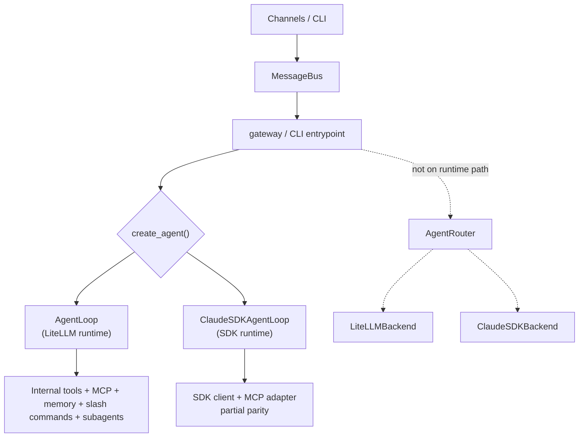
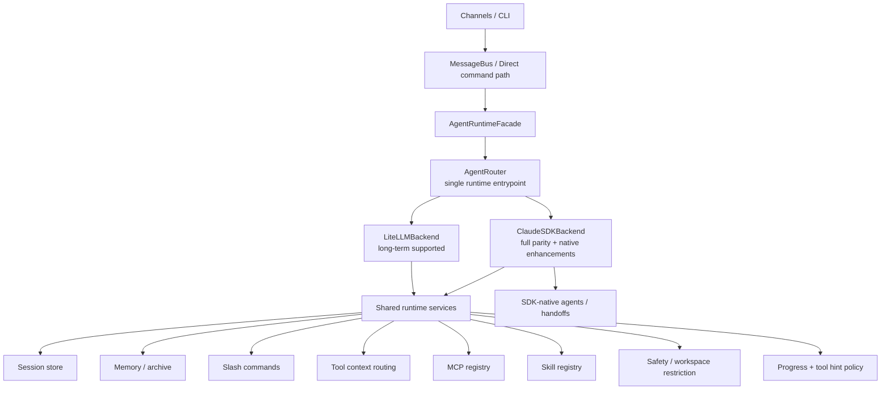

# Agent Router Refactor Plan

> Date: 2026-03-20
> Status: approved direction, pending implementation
> Scope: runtime architecture unification for `litellm` and `claude_sdk`

## Goal

Make `AgentRouter` the only runtime entrypoint for both `gateway` and `nanobot agent`, while keeping `litellm` as a long-term supported backend and making `claude_sdk` the stronger backend with full parity plus SDK-native enhancements.

## Confirmed Decisions

- `AgentRouter` is the final and only runtime entrypoint.
- `litellm` remains a long-term supported production backend.
- `claude_sdk` must reach full parity with the current agent behavior.
- `claude_sdk` should become stronger than the old agent by using SDK-native `agents/handoffs`.
- `Skill`, `MCP`, and core config shape should stay broadly compatible with the current system.
- Provider scope for the SDK path is limited to Anthropic Messages-compatible gateways.
- Slash commands such as `/new`, `/stop`, `/restart`, and `/help` remain product behavior.
- CLI and gateway must behave consistently with respect to `agents.type`.

## Current Architecture

Today there are two overlapping runtime ideas:

1. The real runtime path:
   - `gateway` uses `create_agent()`
   - `create_agent()` branches to `AgentLoop` or `ClaudeSDKAgentLoop`
2. A second unfinished abstraction:
   - `AgentRouter`
   - `LiteLLMBackend`
   - `ClaudeSDKBackend`

That overlap is the main architectural problem.

## Before Refactor

### Problems In The Current Shape

- There are two competing integration models.
- `AgentRouter` is not the source of runtime truth.
- CLI and gateway do not share the same backend selection behavior.
- Claude SDK parity is incomplete.
- Tool routing and safety boundaries differ between backends.

## Target Architecture

The target shape is one runtime contract with two official backends.

## Design Principles

### 1. One runtime contract

Both `gateway` and CLI should enter through the same runtime orchestration layer. Backend choice is a routing decision, not an entrypoint decision.

### 2. Shared behavior above backend-specific model execution

Session policy, slash commands, context routing, progress semantics, tool safety, and MCP/Skill registration should not be reimplemented independently in each backend if they can be centralized.

### 3. Backend-specific logic stays narrow

Each backend should mainly own:

- model/client initialization
- request/response translation
- backend-specific streaming
- backend-specific native features

### 4. Claude SDK uses native orchestration where it adds value

For subagents, the target is not to emulate the old `SpawnTool` forever. The target is to map nanobot semantics onto SDK-native `agents/handoffs`, while preserving user-facing behavior.

## Proposed Runtime Layers

### Layer 1: Entry Layer

Responsible for:

- starting gateway and CLI sessions
- building shared resources
- constructing one router-backed runtime object

Files likely affected:

- `nanobot/cli/commands.py`
- new runtime facade module under `nanobot/agent/`

### Layer 2: Shared Runtime Behavior

Responsible for:

- slash commands
- session lifecycle
- memory consolidation / archival
- tool context injection
- progress event normalization
- safety policy
- MCP / Skill registration policy

This should become the behavioral baseline both backends inherit or consume.

### Layer 3: Backend Adapters

Responsible for:

- translating shared runtime requests into backend-native calls
- translating responses, tool calls, deltas, and usage back into the shared protocol

Backends:

- `LiteLLMBackend`
- `ClaudeSDKBackend`

### Layer 4: Native Enhancement Layer

Only the Claude SDK backend should own:

- SDK-native `agents`
- `handoffs`
- SDK-specific hooks and permission modes

These should be additive, not replacements for baseline behavior.

## Capability Baseline

Both backends must support all of the following:

- same `agents.type` switching semantics
- same CLI and gateway behavior
- same slash commands
- same session identity semantics
- same message routing semantics
- same `message` and `cron` behavior
- same MCP loading rules
- same Skill exposure rules
- same workspace restriction behavior
- same progress/tool hint policy
- same response lifecycle expectations for cron and heartbeat flows

Claude SDK should additionally support:

- SDK-native agents/handoffs
- SDK-native hooks
- better Claude-specific execution flow where compatible with product behavior

## Provider And Gateway Model

The provider model should be simplified for the SDK path:

- `claude_sdk` only supports Anthropic Messages-compatible providers
- `litellm` continues to support the broader provider universe

This means the config system should express:

- shared model/provider defaults
- backend-specific compatibility validation
- a single source of truth for SDK-compatible providers

It should not require two independent provider truth tables that drift over time.

## Migration Strategy

### Phase 1: Make `AgentRouter` real

Objectives:

- route both gateway and CLI through `AgentRouter`
- remove `create_agent()` from the runtime path
- make `LiteLLMBackend` and `ClaudeSDKBackend` minimally functional

Exit criteria:

- one message can be processed through router-backed gateway
- one message can be processed through router-backed CLI

### Phase 2: Extract shared runtime behavior

Objectives:

- move slash command handling, session policy, tool context, and progress policy above backend-specific execution
- remove duplicate orchestration between `AgentLoop` and `ClaudeSDKAgentLoop`

Exit criteria:

- backend swap does not change core user-visible runtime behavior

### Phase 3: Reach full parity for Claude SDK

Objectives:

- fix `message`, `cron`, and routing context
- enforce workspace restriction
- align session and memory behavior
- align cron/heartbeat/direct-processing flows

Exit criteria:

- Claude SDK backend passes the same behavior-oriented smoke tests as LiteLLM backend

### Phase 4: Introduce SDK-native handoffs cleanly

Objectives:

- define nanobot subagent semantics in terms of SDK-native agents/handoffs
- preserve expected user-facing outcomes while modernizing the internals

Exit criteria:

- Claude SDK subagent flow is native-first, not adapter-first

### Phase 5: Remove obsolete code paths

Objectives:

- delete transitional runtime branching
- retire duplicate loops or reduce them to thin internal helpers
- update docs to reflect the actual final architecture

Exit criteria:

- there is one documented architecture and it matches the code

## File-Level Direction

### Keep, but narrow responsibility

- `nanobot/agent/router.py`
- `nanobot/agent/protocol.py`
- `nanobot/agent/backends/litellm_backend.py`
- `nanobot/agent/backends/claude_sdk_backend.py`

### Likely refactor heavily or split

- `nanobot/agent/loop.py`
- `nanobot/agent/claude_sdk_loop.py`
- `nanobot/agent/tool_adapter.py`
- `nanobot/cli/commands.py`

### Likely add

- shared runtime facade / orchestrator module
- shared command handling module
- shared tool-context and progress normalization module
- backend parity tests

## Testing Strategy

The refactor should be proven by behavior, not just syntax.

Minimum test layers:

- router initialization tests
- backend compatibility tests
- CLI/gateway entrypoint consistency tests
- slash command tests
- tool-context routing tests
- workspace restriction tests
- cron/heartbeat direct-processing tests
- parity smoke tests run against both backends

## Recommended Execution Order

1. Make `AgentRouter` the only runtime entry.
2. Make `LiteLLMBackend` a correct wrapper around current behavior.
3. Make `ClaudeSDKBackend` reach baseline parity for routing, tools, and safety.
4. Move shared behavior out of loop-specific implementations.
5. Reintroduce Claude SDK native handoffs on top of the parity baseline.
6. Delete transitional runtime code and refresh docs.

## Non-Goals For The Refactor

- Expanding Claude SDK beyond Anthropic Messages-compatible gateways
- Rewriting all tools from scratch
- Replacing working LiteLLM-specific provider behavior without need
- Introducing a third runtime abstraction in parallel with the router

## Recommendation

This should be treated as a convergence refactor, not a feature patch. The primary success metric is that the runtime has one architecture, one behavior contract, and two official backends. Claude SDK-specific power should be layered on top of that stable contract, not used as a reason to fork the product behavior.
