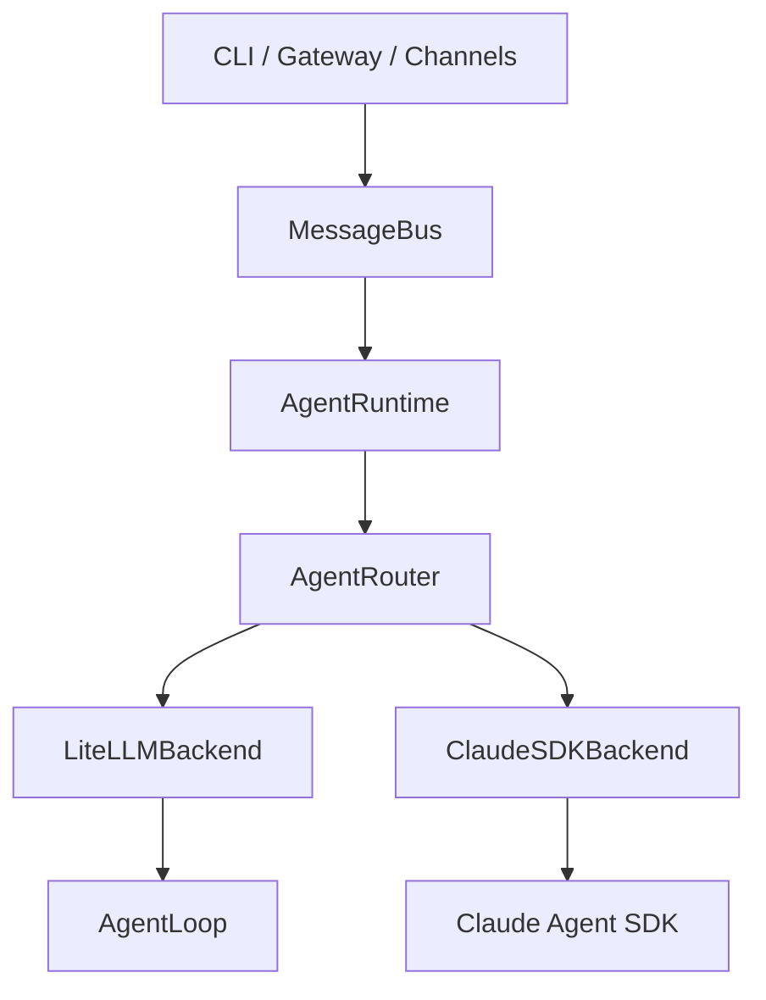
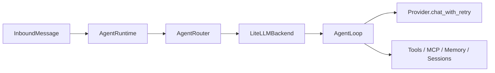
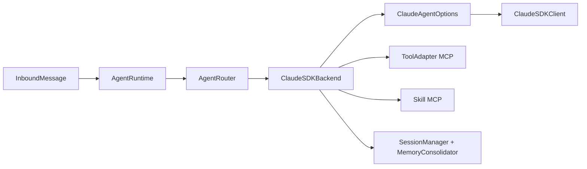

# Current Agent Architecture And Roadmap

> Date: 2026-03-20
> Status: current implementation snapshot

## 1. Summary

`nanobot` now uses a unified runtime architecture:

- `gateway` and `nanobot agent` both enter through `AgentRuntime`
- `AgentRuntime` routes requests through `AgentRouter`
- `AgentRouter` selects one official backend:
  - `litellm`
  - `claude_sdk`

The system is no longer split across separate runtime entrypoints for CLI and gateway. The remaining work is no longer about fixing basic runtime divergence. It is mainly about making Claude SDK native delegation and handoff behavior more productized and strategic.

## 2. Current Architecture

### 2.1 Top-Level Runtime



### 2.2 Responsibilities By Layer

- [runtime.py](/Users/zhaobomin/Documents/projects/thirdpart/nanobot/nanobot/agent/runtime.py)
  - single runtime entrypoint
  - owns slash commands (`/help`, `/new`, `/stop`, `/restart`)
  - owns foreground task tracking
  - forwards backend deltas/tool hints to direct-mode progress callbacks

- [router.py](/Users/zhaobomin/Documents/projects/thirdpart/nanobot/nanobot/agent/router.py)
  - selects backend from `config.agents.type`
  - owns backend lifecycle
  - is the only runtime switch

- [litellm_backend.py](/Users/zhaobomin/Documents/projects/thirdpart/nanobot/nanobot/agent/backends/litellm_backend.py)
  - wraps existing `AgentLoop`
  - preserves old tool/memory/session behaviors
  - acts as the compatibility baseline

- [claude_sdk_backend.py](/Users/zhaobomin/Documents/projects/thirdpart/nanobot/nanobot/agent/backends/claude_sdk_backend.py)
  - builds Claude SDK options
  - wires MCP tools and skills
  - persists sessions
  - integrates reset/cancel/session memory behavior
  - maps configured SDK native agents into SDK `AgentDefinition`

- [tool_adapter.py](/Users/zhaobomin/Documents/projects/thirdpart/nanobot/nanobot/agent/tool_adapter.py)
  - exposes nanobot tools to Claude SDK as MCP tools
  - injects routing context for `message`, `cron`, and `spawn`
  - applies `restrict_to_workspace`

### 2.3 Request Path

#### `litellm`



#### `claude_sdk`



## 3. Current Capability Status

### 3.1 Already Solved

- Unified runtime entrypoint for CLI and gateway
- Official dual backend support through `AgentRouter`
- Runtime-level slash commands
- Claude SDK tool routing context
- Claude SDK workspace restriction parity
- Claude SDK `spawn` support via existing subagent manager
- Session persistence and `/new` reset/archive behavior in Claude SDK path
- `/stop` now cancels both foreground tasks and backend-managed subagents
- Provider registry consolidation to a single source of truth
- Telegram polling conflict now fails fast and stops the channel instead of retry-spamming

### 3.2 Current Design Tradeoff

Claude SDK support is now operational and much closer to parity, but native SDK delegation is still only partially productized:

- nanobot can safely pass configured SDK agents into Claude SDK
- nanobot can still use the old `spawn` semantics for compatibility
- but nanobot does not yet have a first-class policy layer that decides:
  - when a task should stay in the main agent
  - when it should become a background subagent task
  - when it should become a Claude SDK native handoff
  - how handoff results should be summarized and merged back

This is the main remaining architectural gap.

## 4. Config Model

### 4.1 Shared Configuration

- `agents.type`: selects backend
- `agents.defaults.model`: shared model selection
- `agents.defaults.provider`: shared provider selection
- `providers.*`: shared credentials and endpoint settings
- `tools.*`: shared tool policy

### 4.2 Claude SDK Specific Configuration

- `agents.claude_sdk.max_turns`
- `agents.claude_sdk.permission_mode`
- `agents.claude_sdk.agents`
- `agents.claude_sdk.hooks`

At this point, `agents.claude_sdk.agents` is no longer a blind pass-through. The backend converts this config into Claude SDK `AgentDefinition` instances and normalizes tool aliases where needed.

## 5. Transitional Code Status

- [claude_sdk_loop.py](/Users/zhaobomin/Documents/projects/thirdpart/nanobot/nanobot/agent/claude_sdk_loop.py) is no longer on the main runtime path
- it remains as a compatibility/legacy layer
- runtime truth is now:

```text
AgentRuntime -> AgentRouter -> backend
```

This means the main architectural risk is no longer “two live runtimes”. The remaining risk is “one runtime, but not yet one delegation strategy”.

## 6. Recommended Improvement Directions

### Direction 1: Native Handoff Strategy Layer

Goal:
make Claude SDK native delegation a product capability, not just a config surface.

What to add:

- a nanobot-level handoff policy component
- explicit rules for:
  - foreground handling
  - background delegation
  - SDK native handoff
  - fallback to local tools/spawn
- clear result re-entry semantics

Expected benefit:

- less ad-hoc delegation
- stronger Claude SDK differentiation
- easier future replacement of compatibility `spawn`

### Direction 2: Delegation Modes

Goal:
split delegation into clear modes instead of one overloaded concept.

Suggested modes:

- inline handoff
  - another agent takes over part of the reasoning flow and returns immediately
- background delegation
  - long-running task, reports back later
- specialist consultation
  - focused domain agent provides scoped input, main agent remains primary owner

Expected benefit:

- cleaner UX
- easier policy decisions
- better observability

### Direction 3: Result Merge Policy

Goal:
define how delegated outputs return to the main conversation.

Areas to improve:

- summary vs full transcript
- structured merge into memory
- user-visible reporting rules
- failure escalation rules

Expected benefit:

- less context pollution
- better long-session stability
- clearer user-facing behavior

### Direction 4: Agent Profiles

Goal:
make SDK-native agents easier to define and safer to operate.

Suggested additions:

- profile presets for tools
- profile presets for permission modes
- profile presets for model tiers
- profile presets for workspace scope

Expected benefit:

- less repetitive config
- fewer invalid agent definitions
- more intentional specialization

### Direction 5: Delegation Observability

Goal:
make delegation behavior diagnosable in production.

Suggested additions:

- handoff trace IDs
- backend and agent choice logging
- delegated task lifecycle events
- session-level delegation timeline

Expected benefit:

- easier debugging
- easier user support
- safer iteration on policy logic

### Direction 6: Legacy Cleanup

Goal:
finish removing obsolete compatibility layers once the strategy layer is mature.

Likely cleanup targets:

- reduce [claude_sdk_loop.py](/Users/zhaobomin/Documents/projects/thirdpart/nanobot/nanobot/agent/claude_sdk_loop.py) further or delete it
- reduce duplicated delegation semantics between compatibility `spawn` and SDK-native handoff
- narrow backend-specific policy logic

## 7. Suggested Next Sequence

If continuing optimization, the most sensible order is:

1. introduce a handoff strategy layer
2. separate inline handoff vs background delegation semantics
3. define result merge policy
4. add observability around delegation decisions
5. clean up remaining legacy compatibility paths

## 8. Bottom Line

The architecture is now stable enough that future work should target product intelligence, not runtime rescue.

The main question is no longer:

> how do we make Claude SDK work at all?

The main question now is:

> how does nanobot decide to use Claude SDK native delegation in a deliberate, observable, product-level way?
