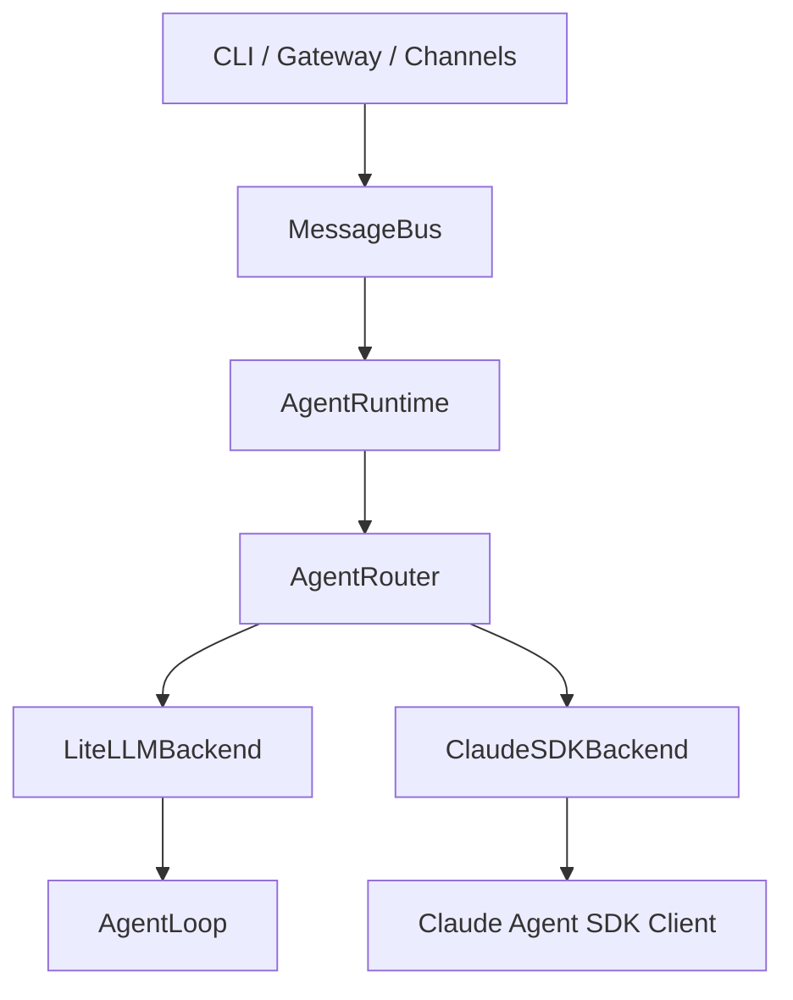

# XBOT Agent 整体演进方案

> 日期：2026-03-20
> 状态：基于当前真实代码与本轮阶段性落地后的最新总方案
> 说明：本文合并了既有架构梳理、AgentRouter 重构规划、Claude SDK review 结论，以及本轮实际落地后的新增结论

## 一、当前阶段结论

当前系统已经完成了本轮主线阶段目标：

- 运行时入口已经统一到 `AgentRuntime -> AgentRouter -> backend`
- `litellm` 和 `claude_sdk` 都是正式后端
- CLI、gateway、Telegram 等主链路已经切到统一运行时
- `claude_sdk` 已补齐核心可用能力
  - 连续会话
  - slash commands
  - progress / tool hint
  - `message` / `cron` / `spawn`
  - `restrict_to_workspace`
  - skill / MCP 基础接入
- 项目已经从 `nanobot` 切换到 `xbot`
  - 包名
  - CLI 命令
  - 默认目录
  - 模板与品牌文案

当前剩余问题已经不是“基础不可用”，而是：

- `claude_sdk` 的 handoff 还只有基础 trace，缺少更强的决策记录与失败回流
- 诊断摘要已经有了运行态快照，但还不是完整的 session 级 trace
- 双后端仍有一部分行为模型差异，需要继续收敛成更稳定的产品定义

## 二、当前架构基线

### 2.1 顶层结构

### 2.2 当前真实能力分布

`litellm`

- 继续作为稳定兼容后端
- 以 `AgentLoop` 为核心
- 本地 history 驱动连续会话
- skill 以 prompt/context 方式暴露
- 工具与 MCP 行为成熟

`claude_sdk`

- 作为增强后端
- 已优先使用 SDK 自身会话机制
- skill 当前采用“双层暴露”
  - 所有 skill 进入 prompt summary
  - 只有 `tool_exposable: true` 的 skill 才转成 MCP/tool
- 更适合承接后续 native `agents/handoffs`

## 三、已经完成的阶段

### 阶段 A：运行时统一

已完成：

- `AgentRouter` 成为唯一正式运行时入口
- gateway 与 CLI 使用同一运行路径
- 旧 `claude_sdk_loop` 退出主链路

### 阶段 B：双后端可用化

已完成：

- 修复 `LiteLLMBackend` 包装问题
- 修复 `ClaudeSDKBackend` 初始化与 Claude CLI 参数错误
- 修复 progress、tool hint、Telegram 可见性
- 修复 provider registry 双真相源问题

### 阶段 C：Claude SDK 核心 parity

已完成：

- `message` / `cron` / `spawn` 上下文恢复
- `/new` / `/stop` / `/restart` / `/help`
- session 持久化
- memory consolidation 接回
- `restrict_to_workspace`
- SDK client 会话复用
- 基于 SDK session 的连续会话
- 模板 prompt 与 `litellm` 对齐

### 阶段 D：品牌切换

已完成：

- `nanobot` -> `xbot`
- 默认目录切到 `~/.xbot`
- workspace 模板、CLI、Docker、bridge、发布入口同步切换

### 阶段 E：能力治理与策略收口

已完成：

- `CapabilityCatalog` 已成为 `skill / builtin tool / external MCP` 的共享基础视图
- `tool_exposable: true` 已成为 skill tool 化的明确开关
- external MCP 在 `claude_sdk` 下的分类判断已补齐，避免被误标成普通 builtin tool
- `claude_sdk` 已补上 handoff policy 基础层
  - system prompt delegation policy
  - specialist agent prompt policy
  - activation trace
  - 基础 handoff task trace
- `litellm` 与 `claude_sdk` 都能通过统一 runtime 输出过程消息 / tool hint
- runtime / backend 诊断摘要已升级为包含运行态信息
  - `connected_sessions`
  - `registered_tools`
  - `mcp_connected`
  - `handoff_agents`

## 四、当前仍然存在的主要问题

### 4.1 Claude SDK 还没有完整的产品级 handoff 策略层

当前已经支持：

- SDK 原生 agent 定义配置
- SDK 会话复用
- 旧 `spawn` 兼容
- handoff activation / task trace

但仍未完成：

- handoff 的决策记录
- handoff 失败后的标准降级路径
- handoff 结果如何更明确地回流主会话
- handoff 是否进入 memory / summary
- session 级 handoff trace

### 4.2 `skill / tool / MCP` 还缺更强的治理层

当前已经做到：

- 同一 skill 来源目录
- 同一模板 prompt 发现机制
- `tool_exposable: true` 控制是否 tool 化
- external MCP / builtin tool / skill 已进入共享 catalog
- tool hint 分类已统一到共享分类层

但仍未完成：

- 按 agent/profile 精细裁剪能力
- 统一能力可见性、权限、观测
- 更强的 capability policy

### 4.3 双后端仍有部分行为差异

当前差异主要是：

- `litellm` 的 skill 执行偏 prompt-driven
- `claude_sdk` 的 skill 执行偏 prompt + tool-driven
- 外部 MCP 在两个后端中的心智模型仍不完全一致

这不是立即阻塞，但需要收敛成产品定义。

## 五、总体演进原则

后续所有改造建议遵守这几个原则：

1. `AgentRouter` 继续保持唯一运行时入口
2. `litellm` 保持长期正式支持，不做降级后端
3. `claude_sdk` 作为增强后端，优先承接更强能力
4. `skill` 保持单一来源，不拆多套目录
5. 所有新增能力，优先收敛成共享 policy/catalog，再投影到不同 backend
6. 不为了“实现长得一样”而强行把两个 backend 做成同构

## 六、下一阶段演进计划

### 阶段 1：handoff runtime policy 深化

目标：

把 `claude_sdk` 的 handoff 从“有规则、有基础 trace”推进到“有决策、有回流、有失败降级”。

本阶段重点：

- 给 handoff 增加显式 decision trace
- 记录 handoff 失败与 fallback
- 定义 handoff 结果回流主会话的标准结构
- 定义 handoff 与 `spawn` 的明确边界

本阶段结束标志：

- 能清楚回答“为什么这次发生 handoff / 为什么没发生 / 失败后走了什么降级”

### 阶段 2：capability policy 深化

目标：

把共享 capability catalog 升级成真正的 capability policy。

本阶段重点：

- 按 backend/profile 裁剪 capability
- 明确哪些 capability 只 prompt 暴露
- 明确哪些 capability 可以 tool / MCP 暴露
- 增加 capability 选择原因与装配结果

本阶段结束标志：

- 能清楚回答“某个 agent 现在为什么能看到这些能力、为什么看不到另一些”

### 阶段 3：运行态观测深化

目标：

从“摘要可看”升级到“问题可定位”。

本阶段重点：

- 增加 session 级 trace
- 增加 MCP 连接结果与失败原因
- 增加 handoff / spawn / tool 调用链路快照
- 增加 channel 侧可观测性补充

本阶段结束标志：

- 复杂问题不再只能靠盯原始日志排查

### 阶段 4：双后端产品行为继续收敛

目标：

继续压缩两种 backend 的行为差异。

本阶段重点：

- 继续统一 skill 的产品语义
- 收敛 MCP 的用户心智
- 收敛 slash commands / session / reset / cancel 的外部表现
- 评估是否继续削弱旧 `spawn` 语义

本阶段结束标志：

- 用户切换 backend 时，不会感知成“两个不同产品”

### 阶段 5：遗留代码与历史文档清理

目标：

在架构稳定后，再清理过渡实现和历史包袱。

本阶段重点：

- 进一步削弱或删除 `claude_sdk_loop.py`
- 清理历史 `nanobot` 文档残留
- 清理无用兼容逻辑
- 补做 Docker / deploy / plugin 生态层最终验证

本阶段结束标志：

- 仓库内运行时真相、文档真相、发布真相一致

## 七、建议优先级

如果只按大颗粒排优先级，建议是：

1. 先做“能力治理层收口”
2. 再做“Claude SDK handoff 策略层”
3. 再做“双后端产品行为收敛”
4. 最后补“观测能力”和“遗留清理”

原因很简单：

- 如果没有 capability policy，handoff 策略会缺输入
- 如果没有 handoff 策略层，`claude_sdk` 的增强价值释放不出来
- 如果没有统一观测，后面复杂行为会越来越难查

## 八、阶段性目标定义

接下来最合理的短中期目标不是继续做零散 patch，而是达成这三个里程碑：

### 里程碑 1

`xbot` 能清楚定义并治理自身能力面：

- skill
- builtin tools
- external MCP

### 里程碑 2

`claude_sdk` 成为真正更强的正式后端，而不是仅仅“另一个可选实现”。

### 里程碑 3

双后端在产品认知上可解释，用户可以放心切换，而不是靠经验猜差异。

## 九、一句话总结

前半段工作已经完成了“统一运行时 + 补齐核心能力 + 修复已知 bug + 完成品牌切换”。

后半段真正值得投入的，不再是继续打补丁，而是：

- 建立统一 capability 治理层
- 建立 Claude SDK handoff 策略层
- 让双后端差异变成设计结果，而不是实现副作用
