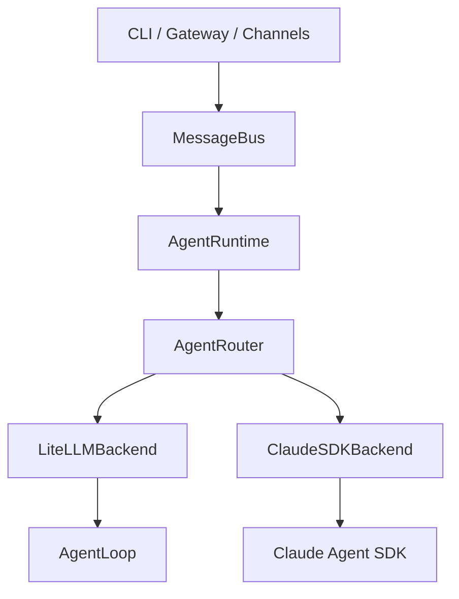
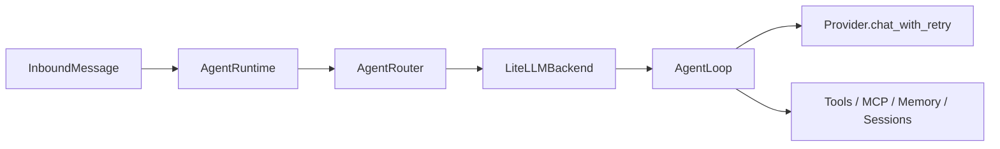
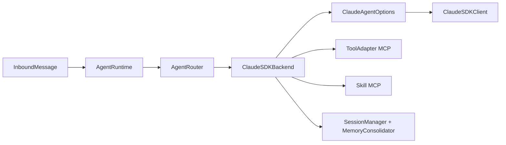

# 当前 Agent 架构与后续演进方向

> 日期：2026-03-20
> 状态：基于当前代码实现的真实快照

## 一、当前整体结论

`nanobot` 现在已经完成了 Agent 运行时的统一收口：

- `gateway` 和 `nanobot agent` 都通过统一入口运行
- 统一入口是 `AgentRuntime`
- `AgentRuntime` 通过 `AgentRouter` 选择正式后端
- 当前正式后端有两个：
  - `litellm`
  - `claude_sdk`

也就是说，当前系统已经不再是“CLI 一套、gateway 一套、Claude SDK 另外一套”的分裂状态。当前剩余的主要问题，已经不是基础运行时 bug，而是如何把 Claude SDK 的原生 delegation / handoff 能力做成更完整的产品策略层。

## 二、当前真实架构

### 2.1 顶层运行时结构



### 2.2 各层职责

#### `AgentRuntime`

文件：
[runtime.py](/Users/zhaobomin/Documents/projects/thirdpart/nanobot/nanobot/agent/runtime.py)

职责：

- 作为唯一运行时入口
- 统一处理 slash commands
  - `/help`
  - `/new`
  - `/stop`
  - `/restart`
- 管理前台任务生命周期
- 将 backend 的 delta / tool hint 转发给 direct 模式的 progress 回调

#### `AgentRouter`

文件：
[router.py](/Users/zhaobomin/Documents/projects/thirdpart/nanobot/nanobot/agent/router.py)

职责：

- 根据 `config.agents.type` 选择 backend
- 管理 backend 初始化、切换、关闭
- 作为唯一 backend 路由层

#### `LiteLLMBackend`

文件：
[litellm_backend.py](/Users/zhaobomin/Documents/projects/thirdpart/nanobot/nanobot/agent/backends/litellm_backend.py)

职责：

- 包装现有 `AgentLoop`
- 维持旧体系能力基线
- 保留原有工具、session、memory、MCP 行为

#### `ClaudeSDKBackend`

文件：
[claude_sdk_backend.py](/Users/zhaobomin/Documents/projects/thirdpart/nanobot/nanobot/agent/backends/claude_sdk_backend.py)

职责：

- 构造 `ClaudeAgentOptions`
- 接入 Claude Agent SDK
- 注册 SDK 所需 MCP 工具与 skills
- 维护 Claude SDK 路径下的 session 持久化
- 接入 reset / cancel / memory consolidation
- 将 `agents.claude_sdk.agents` 转为 SDK 原生 `AgentDefinition`

#### `ToolAdapter`

文件：
[tool_adapter.py](/Users/zhaobomin/Documents/projects/thirdpart/nanobot/nanobot/agent/tool_adapter.py)

职责：

- 将 nanobot 内部工具暴露给 Claude SDK 作为 MCP tools
- 为 `message`、`cron`、`spawn` 注入会话上下文
- 在 Claude SDK 路径下执行工具权限收敛
- 应用 `restrict_to_workspace`

## 三、两条主执行路径

### 3.1 `litellm` 路径



特点：

- 完整继承旧 `AgentLoop` 行为
- 是当前兼容性基线
- 子代理、memory consolidation、旧工具语义都最成熟

### 3.2 `claude_sdk` 路径



特点：

- 直接使用 Claude Agent SDK
- 支持 Anthropic Messages 兼容 provider
- 具备 SDK 原生 agent / hooks 的接入能力
- 已补齐大部分核心 parity，但 delegation 策略还不够产品化

## 四、当前已经完成的优化

### 4.1 架构收口

已经完成：

- CLI 与 gateway 统一走 `AgentRuntime`
- `AgentRouter` 成为唯一正式运行时路由入口
- `litellm` 与 `claude_sdk` 成为正式 backend
- `claude_sdk_loop.py` 不再是主运行路径

### 4.2 Claude SDK 基础能力补齐

已经完成：

- 工具上下文注入
- `message` / `cron` / `spawn` 路由上下文恢复
- `restrict_to_workspace` 对齐
- `spawn` 支持
- session 持久化
- `/new` reset + archive-clear
- `/stop` 级联取消 backend session 内 subagent
- direct 模式 progress 回调透传

### 4.3 配置与 provider 收口

已经完成：

- provider registry 统一为单一真相源
- `config/provider_registry.py` 现在只是兼容视图
- Claude SDK provider 校验与默认 base URL 已纳入统一数据体系

### 4.4 通道稳定性补丁

已经完成：

- Telegram `getUpdates` 冲突不再无限刷日志
- 遇到 `Conflict` 时会明确记录原因并主动停止当前 Telegram channel

## 五、当前仍然存在的主要设计缺口

当前最大的缺口，不再是基础 bug，而是：

**Claude SDK native handoff 还只是“安全映射层”，还不是“策略层”。**

目前已经做到的，是：

- 可以把 `agents.claude_sdk.agents` 安全转换成 SDK `AgentDefinition`
- 可以把配置中的工具名做规范化
- 可以继续兼容旧 `spawn` 语义

但目前还没有一个 nanobot 自己的高层策略组件，来决定：

- 什么任务应该留在主 agent 内部处理
- 什么任务应该交给后台 delegation
- 什么任务应该触发 Claude SDK native handoff
- handoff 结果应该如何回流主会话
- handoff 失败时如何降级
- handoff 结果是否进入 memory / session summary

这也是当前后续优化里最值得优先解决的方向。

## 六、当前配置模型

### 6.1 共享配置

以下配置当前是双 backend 共享的：

- `agents.type`
- `agents.defaults.model`
- `agents.defaults.provider`
- `providers.*`
- `tools.*`

这意味着：

- 切换 backend 不需要重新维护一套 provider 配置
- provider / model / workspace 仍然保持统一入口

### 6.2 Claude SDK 专属配置

以下配置是 Claude SDK 专属的：

- `agents.claude_sdk.max_turns`
- `agents.claude_sdk.permission_mode`
- `agents.claude_sdk.agents`
- `agents.claude_sdk.hooks`

当前状态下，`agents.claude_sdk.agents` 已经不是简单透传，而是会被 backend 转成 SDK 原生定义对象。

## 七、过渡代码状态

当前仍存在的过渡代码：

- [claude_sdk_loop.py](/Users/zhaobomin/Documents/projects/thirdpart/nanobot/nanobot/agent/claude_sdk_loop.py)

当前定位：

- 已经不在主运行路径上
- 属于兼容/过渡实现
- 不是当前运行时真相源

当前真正的运行时事实是：

```text
AgentRuntime -> AgentRouter -> backend
```

因此，当前主要风险已经不是“双运行时并存”，而是“单运行时已经稳定，但 delegation/handoff 还没有统一策略层”。

## 八、后续改进方向

### 方向 1：Claude SDK Native Handoff 策略层

目标：

把 Claude SDK native handoff 从“配置能力”升级成“产品能力”。

建议补充：

- handoff policy 组件
- 明确的 delegation 决策规则
- handoff 与本地工具/旧 `spawn` 的降级关系
- handoff 结果回流规则

价值：

- 让 Claude SDK 路径真正强于旧 agent
- 降低 delegation 行为的随意性
- 为后续逐步替换兼容 `spawn` 打基础

### 方向 2：拆分 Delegation 模式

目标：

不要把所有“交给别的 agent 做”都看成同一种行为。

建议拆分：

- inline handoff
  - 在当前推理链中暂时交给专门 agent
- background delegation
  - 后台异步执行，完成后回流
- specialist consultation
  - 获取特定领域结果，主 agent 仍为主控

价值：

- 用户体验更清晰
- 策略判断更容易
- 日后可观测性更好

### 方向 3：结果回流与汇总策略

目标：

定义 delegation / handoff 的结果如何回到主会话。

建议补充：

- 回流时是全文、摘要还是结构化结果
- 是否写入 memory
- 是否进入 session history
- 是否需要用户可见说明
- 失败是否自动降级或重试

价值：

- 避免上下文污染
- 提高长会话稳定性
- 提高行为一致性

### 方向 4：Agent Profile / Policy Profile

目标：

降低配置复杂度，提升 agent specialization 的表达能力。

建议增加：

- 工具白名单 profile
- 权限模式 profile
- 模型档位 profile
- workspace scope profile

价值：

- 减少重复配置
- 降低 agent 定义错误率
- 更适合形成系统级 agent 策略

### 方向 5：Delegation 可观测性

目标：

让 handoff / delegation 行为更容易排查。

建议增加：

- handoff trace id
- agent 选择日志
- delegation 生命周期事件
- session 维度 delegation 时间线

价值：

- 便于排错
- 便于运营支持
- 便于后续继续迭代策略层

### 方向 6：清理过渡代码

目标：

在策略层成熟后，进一步删除兼容负担。

建议清理：

- 继续收缩或删除 `claude_sdk_loop.py`
- 减少旧 `spawn` 语义与 native handoff 的重复概念
- 缩小 backend 内部各自维护的策略逻辑

## 九、建议的后续推进顺序

如果后面继续优化，建议顺序是：

1. 建 handoff 策略层
2. 拆分 delegation 模式
3. 定义结果回流策略
4. 补可观测性
5. 清理过渡代码

## 十、总结

当前 `nanobot` 的 Agent 架构已经进入一个新的阶段：

- 基础运行时问题基本已经收口
- 已知阻塞 bug 基本已经修完
- Claude SDK 已经从“半接线状态”变成正式 backend

接下来的重点，不再是“让 Claude SDK 能跑起来”，而是：

**让 Claude SDK 的 native delegation / handoff 变成一个可控、可观测、可演进的产品策略层。**
